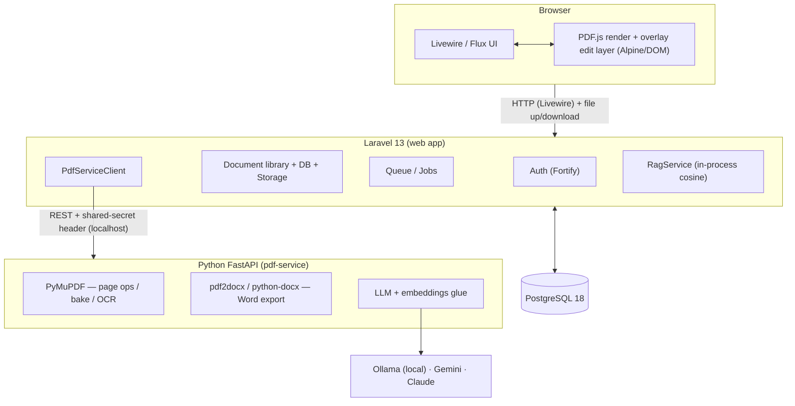

# Lapis

> **Edit PDFs without breaking them.**
> Upload, organize, annotate, fill forms, sign, OCR, export to Word, and chat with your
> documents, without ever re-encoding the original file.

Lapis is a portfolio web app. A signed-in user manages and **edits their own PDFs live in
the browser**, with pixel-perfect rendering, an **AI assistant**, and a **smart PDF → Word export**.
It pairs a **Laravel 13 + Livewire 4** application with a **Python FastAPI** microservice for the
work that must touch PDF bytes or run ML.

<p>
  
  
  
  
  
  
  
  
</p>

<!-- Screenshots: capture instructions live in docs/screenshots/README.md, then link them here. -->

---

## Table of contents

- [Features](#features)
- [The Golden Rule (fidelity)](#the-golden-rule-fidelity)
- [Architecture](#architecture)
- [The smart Word-export story](#the-smart-word-export-story)
- [The AI assistant (RAG) story](#the-ai-assistant-rag-story)
- [Tech stack](#tech-stack)
- [Getting started (local)](#getting-started-local)
- [Running the whole stack with Docker](#running-the-whole-stack-with-docker)
- [Deployment](#deployment)
- [Testing & quality gates](#testing--quality-gates)
- [Engineering decisions](#engineering-decisions)
- [Project status](#project-status)
- [License](#license)

---

## Features

| Area | What you can do |
|------|-----------------|
| **Library** | Upload PDFs (validated, size/page-capped), browse, rename, download, soft-delete, merge. Private per user. |
| **Viewer** | Pixel-perfect client-side rendering with **PDF.js** + a page rail. Original bytes streamed as-is. |
| **Overlay editor** | Add **text, whiteout, highlight, underline, strike, shapes, freehand, images** on an additive layer; zoom-independent placement; autosave + undo/redo. |
| **Page operations** | **Reorder, rotate, delete, split, merge** with 100% fidelity — pages are copied, never re-rendered. |
| **Forms & signatures** | Detect & fill **AcroForm** fields; **draw / type / upload** a signature; flatten onto the page. Reusable signatures per user. |
| **OCR** | Make scanned PDFs searchable via PyMuPDF's bundled Tesseract (no system Tesseract/Ghostscript). |
| **Smart Word export** | Native pages convert layout-aware (`pdf2docx`); scanned pages are **OCR'd first** then rebuilt — the edge over naive converters. Runs async. |
| **AI assistant** | **Chat with your PDF** (grounded RAG with `(p. N)` citations), **summarize**, and **translate** — for native *and* scanned documents. |
| **Versioning** | Every bake produces a **new version**; the original upload is immutable. Restore is append-only. |

---

## The Golden Rule (fidelity)

> **Never regenerate the whole PDF. Preserve the original bytes; apply edits as an additive
> overlay layer. Editing is non-destructive by default.**

A PDF stores *positioned glyphs*, not a reflowable document. Re-encoding the whole file is what
makes other editors corrupt fonts, lines and layout. Lapis avoids that entirely:

- The **original upload is immutable** — it is never overwritten.
- Every edit is stored as **structured JSON overlay operations** in **PDF user space**
  (points, bottom-left origin), so placement is deterministic regardless of zoom.
- A flattened PDF is produced **on demand** by baking overlays onto a *copy* of the original with
  PyMuPDF, and saved as a **new version** (rotation-aware). The original stays byte-identical —
  this is asserted in the test suite.

This single constraint drives the whole architecture: rendering is client-side (PDF.js) for
fidelity, and byte-level operations live in an isolated Python service.

---

## Architecture



**Why two services?** Display rendering is client-side (PDF.js) for speed and fidelity. Anything
that must touch PDF bytes or run ML (page ops, baking, OCR, Word export, embeddings, the LLM) lives
in the Python service, called over localhost with a shared-secret header. Laravel orchestrates
everything else: auth, the document library, the database, file storage, queued jobs, rate limiting,
and RAG retrieval over its own DB.

### Repository layout

```
pdf-editor/
├── app/                         # Laravel: models, Livewire components, services, jobs, policies
│   ├── Livewire/Documents/      # Index, Show, Organize, Editor, AiAssistant
│   └── Services/                # PdfServiceClient, PageOperationService, ExportService, RagService, …
├── resources/js/pdf-editor/     # PDF.js viewer + overlay editor (coords.js, page-manager.js, …)
├── database/seeders/samples/    # Committed demo PDFs + thumbnails + manifest (generator script)
├── pdf-service/                 # Python FastAPI microservice
│   └── app/{routers,services,schemas,core}/
├── docker/                      # nginx / php / supervisor / entrypoint for the app image
├── docker-compose.yml           # db + app + queue + pdf-service
└── .claude/plan/                # The phased build plan (source of truth across sessions)
```

### Laravel ↔ Python contract (endpoints)

| Method & path | Purpose |
|---|---|
| `GET /health` | Liveness + version (secret-protected) |
| `POST /pdf/info` | Page count, sizes, native-vs-scanned detection |
| `POST /pdf/thumbnails` | Per-page preview images |
| `POST /pdf/pages` | Organize / split / merge → new PDF (lossless) |
| `POST /pdf/bake` | Apply overlay JSON onto a copy → flattened PDF (rotation-aware) |
| `POST /pdf/form-fields` · `/fill` | Detect / fill AcroForm fields (+ optional flatten) |
| `POST /pdf/ocr` | OCR → searchable PDF + extracted text (cached by content hash) |
| `POST /pdf/export/docx` | Smart PDF → DOCX (native path or OCR-first path) |
| `POST /pdf/extract-text` | Per-page text (OCR fallback) for AI/RAG |
| `POST /ai/embed` · `/chat` · `/summarize` · `/translate` | Embeddings + grounded LLM features |

Every request carries an `X-Pdf-Secret` header; the service binds to localhost and rejects
mismatches. The provider key for the LLM lives **only** in `pdf-service/.env`.

---

## The smart Word-export story

PDF → Word is inherently lossy, so the goal is *best-effort and honest about it*. The trick is that
**one converter does not fit both kinds of PDF**:

- **Native (text) PDFs** → `pdf2docx`, which reconstructs a layout-aware `.docx`. Anything it silently
  drops (runs that overlap a watermark or logo) is recovered into a labelled appendix, comparing words
  with ligatures folded and accents stripped so a PDF's "office" is not mistaken for missing text.
- **Scanned / image PDFs** → `pdf2docx` *refuses* them ("Words count: 0 … not supported"), so a naive
  pipeline produces an empty file. Lapis instead **runs OCR first** (PyMuPDF's bundled Tesseract) and
  rebuilds the document from the recognized spans with `python-docx` — carrying over the real page size
  and orientation, margins taken from where the text sits, per-span font size and weight, detected
  paragraph alignment, headings, and a column-aware reading order.
- **Mixed PDFs** → both, page by page: `pdf2docx` converts the file so the native pages keep their
  layout, and OCR runs on **only** the image-only pages, whose text is folded back in. (Previously the
  whole file was OCR'd, throwing away every native page's layout.)

If `pdf2docx` fails outright, the export falls back to the same span-rebuilding renderer rather than
returning nothing, and a mixed file with no OCR data available still exports its native pages.

The export endpoint detects the document's `source_type` and picks the path automatically; the chosen
engine (`pdf2docx` or `ocr+python-docx`) is recorded on the job. Exports run **asynchronously**
(`export_jobs` table + queued job); the viewer's "Export to Word" modal polls status and reveals the
download. OCR uses PyMuPDF's **bundled** Tesseract, so there is **no system Tesseract or Ghostscript**
dependency — only a small `tessdata/<lang>.traineddata` language file.

---

## The AI assistant (RAG) story

One "AI Assistant" side panel offers **Chat with PDF**, **Summarize**, and **Translate**, for native
*and* scanned documents.

1. **Extract** — `/pdf/extract-text` returns per-page text, falling back to OCR for scanned/mixed pages.
2. **Chunk & embed** — `ChunkingService` makes per-page overlapping chunks; `/ai/embed` embeds them.
   The default embedding provider is a deterministic **local `hash`** function (no key, offline) —
   **Voyage AI** is the optional real-semantic provider.
3. **Retrieve** — embeddings are stored as **portable JSON float arrays** on `document_chunks` and
   ranked **in-process by cosine** in `RagService` (documents are owner-scoped and bounded, so this is
   cheap, and it avoids depending on pgvector being installed).
4. **Answer** — `/ai/chat` calls the selected LLM with the retrieved context and returns a grounded
   answer with `(p. N)` citations. The panel has a **per-request model toggle**, so you can switch
   between a **local Ollama** model (offline, no API key — the default) and **Google Gemini** without
   restarting anything; **Anthropic Claude** is supported as a third backend. The call **streams
   internally** (to dodge HTTP timeouts) but returns the whole answer; the panel shows a
   "Thinking…" state.

Guardrails: a per-user rate limit, input-character caps for summarize/translate, and every service call
wrapped in graceful error handling. **AI output stays in the panel — it is never written onto the PDF.**

---

## Tech stack

**Web app:** PHP 8.4 · Laravel 13 · Livewire 4 · Flux UI v2 · Fortify (auth) · Tailwind CSS v4 · Vite ·
PDF.js (`pdfjs-dist` v6) · Alpine.js · Pest 4 · Larastan (level 7) · Pint.

**Microservice:** Python 3.12+ · FastAPI · Uvicorn · PyMuPDF · `pdf2docx` / `python-docx` ·
pluggable LLM backends (Ollama · Gemini · Anthropic) · pytest · ruff · black.

**Data & infra:** PostgreSQL 18 · database queue driver · private file storage · Docker Compose.

---

## Getting started (local)

### Prerequisites

- PHP 8.4 + Composer (this project is developed with **Laravel Herd** on Windows)
- Node 20+ / npm
- Python 3.12+ (3.12 recommended for the widest wheel compatibility)
- PostgreSQL 18 (databases `pdf_editor` and `pdf_editor_test`)

### 1. The Laravel app

```bash
composer install
npm install
cp .env.example .env          # set DB creds + a shared PDF_SERVICE_SECRET
php artisan key:generate
php artisan migrate --seed     # seeds demo@example.com / password + a sample library
npm run build                  # or `npm run dev` while developing
```

With Herd the app is served at `https://pdf-editor.test`. Otherwise use `php artisan serve`.

### 2. The Python pdf-service

```bash
cd pdf-service
python -m venv .venv
.venv/Scripts/activate          # Windows; use `source .venv/bin/activate` on macOS/Linux
pip install -r requirements.txt
cp .env.example .env            # set PDF_SERVICE_SECRET to MATCH the Laravel value
uvicorn app.main:app --reload --port 8001
```

OCR / Word export need a language file — download `eng.traineddata` into `pdf-service/tessdata/`
(see `pdf-service/tessdata/README.md`).

The AI assistant needs an LLM backend, configured in `pdf-service/.env`. Pick whichever you prefer:

| Backend | What to set | Notes |
|---|---|---|
| **Ollama** (default) | `AI_PROVIDER=ollama`, then `ollama pull qwen2.5:3b` | Runs locally, offline, **no API key** |
| **Gemini** | `GEMINI_API_KEY=…` | Free tier at [Google AI Studio](https://aistudio.google.com/app/apikey) |
| **Claude** | `ANTHROPIC_API_KEY=…` | Optional third backend |

Without any of them the app still runs — upload, editing, page ops, OCR, Word export, extract-text
and the offline `hash` embeddings all keep working; only the chat/summarize/translate calls error out.

**Demo login:** `demo@example.com` / `password` (created by the seeder).

---

## Running the whole stack with Docker

The compose stack runs everything — app, queue worker, `pdf-service`, and PostgreSQL (with pgvector
available) — with one command.

```bash
cp .env.example .env
# set APP_KEY (php artisan key:generate --show), PDF_SERVICE_SECRET, DB_PASSWORD
# optionally add an LLM key (GEMINI_API_KEY / ANTHROPIC_API_KEY) — Ollama needs none

docker compose build
docker compose up -d
docker compose exec app php artisan migrate --seed
```

Open the app at `http://localhost:8080` (override with `APP_PORT`). Inside the network, services reach
each other by name: `db:5432` and `http://pdf-service:8001`. Handy commands:

```bash
docker compose logs -f pdf-service     # follow a service's logs
docker compose exec app php artisan tinker
docker compose down                    # stop everything (add -v to drop volumes/data)
```

What's in the stack:

| Service | Image / build | Role |
|---|---|---|
| `db` | `pgvector/pgvector:pg18` | PostgreSQL (pgvector available for a future upgrade) |
| `app` | `Dockerfile` (PHP-FPM + nginx + supervisor) | Laravel web app on port 8080 |
| `queue` | same image as `app` | `php artisan queue:work` (OCR / export / AI jobs) |
| `pdf-service` | `pdf-service/Dockerfile` | Python FastAPI |

> Volumes persist Postgres data, uploaded PDFs, and the OCR cache. Mount your `tessdata/` to enable OCR.

---

## Deployment

Two reasonable targets:

- **Simplest real host** — a small VPS with Docker: `git pull` → `docker compose up -d --build` →
  `docker compose exec app php artisan migrate --force`. Put TLS (Caddy / nginx / a load balancer) in
  front of the `app` service on port 8080.
- **Managed split** — Laravel on **Laravel Cloud**, the `pdf-service` on a container host
  (Fly.io / Render), and **managed Postgres**. Fewer ops, more moving parts.

Production hardening: a real `PDF_SERVICE_SECRET`, a strong DB password, `APP_ENV=production` (the app
entrypoint runs `config:cache` / `route:cache` / `view:cache`), HTTPS, persistent volumes for uploads,
and keeping the `pdf-service` unreachable from the public internet (shared-secret + private network only).

---

## Testing & quality gates

```bash
# Laravel
php artisan test --compact
vendor/bin/pint                      # code style
vendor/bin/phpstan analyse --memory-limit=1G   # larastan, level 7

# Python (from pdf-service/, venv active)
python -m pytest -q
python -m ruff check app tests
python -m black --check app tests
```

Every feature flow is covered by Pest feature tests (Livewire components, policies, file streaming,
seeding) and the Python service by pytest (every route + service function, with small in-memory fixture
PDFs). The Python service is **mocked** in Laravel tests via HTTP fakes, and the LLM is faked on both
sides — so the whole suite runs offline with no provider key.

---

## Engineering decisions

A few choices worth calling out (full rationale lives in `.claude/plan/`):

- **Overlay / non-destructive editing** — edits are JSON ops baked onto a copy on demand, never a
  whole-file re-encode. This is the core fidelity guarantee.
- **Laravel + Python microservice** — keep PHP free of heavy native PDF/ML deps; isolate untrusted PDF
  processing; let each side do what it's best at. One typed `PdfServiceClient` wraps the contract.
- **Client-side overlay editor (Alpine/DOM over PDF.js)** — no canvas/Fabric.js dependency; geometry in
  PDF user space converted with PDF.js's own viewport math, so placement is zoom-independent.
- **OCR via PyMuPDF's bundled Tesseract** — no system Tesseract/Ghostscript; only a language data file.
- **Smart export = source-type-aware** — `pdf2docx` for native, OCR-then-`python-docx` for scanned,
  because `pdf2docx` refuses scanned input. Async via a queued job + `export_jobs`.
- **RAG vector store = portable JSON + in-process cosine** — chosen because the dev/CI Postgres lacks the
  `vector` extension; documents are owner-scoped and bounded, so this is cheap, with a pgvector upgrade
  path documented in the migration.
- **All LLM/embedding calls server-side in Python** — the provider key never reaches Laravel or the
  browser; Laravel orchestrates, rate-limits, and persists.

---

## Project status

All planned phases are built (foundation, document management, page operations, overlay editor, forms &
signatures, smart Word export, AI assistant, and this polish/deploy phase). See `.claude/plan/STATUS.md`
for the live board and decision log.

This is a personal portfolio project.

---

## License

Released under the [MIT License](LICENSE) — © 2026 FabianOkky.
