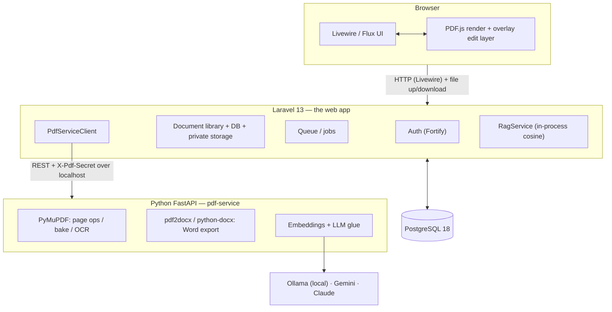

# Architecture

Lapis is built around a single constraint. Everything else — the two-service split, the
client-side renderer, the shape of the database — is a consequence of it.

---

## 1. The Golden Rule

> **Never regenerate the whole PDF. Preserve the original bytes; apply edits as an additive
> overlay layer. Editing is non-destructive by default.**

A PDF is not a document in the word-processor sense. It is a display list of *positioned
glyphs* referencing embedded (often subsetted) fonts, plus vector paths and images. There is no
reliable way to "reflow" it. When an editor parses a PDF into an internal model and writes a new
file from that model, every piece of information it failed to understand is lost — which is why
so many tools return a file with substituted fonts, shifted baselines and vanished rules.

Lapis sidesteps the problem instead of solving it:

| Rule | How it is enforced |
|---|---|
| The original upload is immutable | It is written once to a private disk and never opened for writing again. A feature test asserts the bytes are unchanged after a bake. |
| Edits are data, not pixels | Every edit is a row in `document_overlays` with a JSON `payload`, not a re-rendered page. |
| Flattening is on demand and additive | PyMuPDF opens a **copy**, draws the overlays on top, and saves the result as a **new version**. Untouched content is never re-encoded. |
| History only grows | Versions are append-only; "restore" creates a new version rather than deleting one. |

"Editing existing text" follows the same rule: it is a whiteout rectangle over the old glyphs
plus a new text box on top, not a mutation of the content stream.

---

## 2. Two services, and why



**Why not do it all in PHP?** The mature PDF and ML toolchain is Python (PyMuPDF, Tesseract,
pdf2docx). Binding that to PHP would mean heavy native extensions in the web tier. Isolating it
also contains risk: PDFs are untrusted input and a known exploit vector, so parsing them happens
in a separate process that holds no credentials, no session and no database connection.

**Why not do it all in Python?** Auth, a document library, policies, migrations, queues, forms
and a component-driven UI are exactly what Laravel is good at. Splitting along "does this touch
PDF bytes?" keeps each side idiomatic.

**Why render in the browser?** PDF.js is the same renderer Firefox ships — fast, faithful, and
it puts zero rendering load on the server. The server never rasterizes a page just to show it.

### The boundary

- Base URL comes from `services.pdf.url` (`PDF_SERVICE_URL`, default `http://127.0.0.1:8001`).
- Every request carries an `X-Pdf-Secret` header; the service rejects a mismatch with `401`.
- The service binds to localhost and is never exposed publicly.
- One typed client — [`app/Services/PdfServiceClient.php`](../app/Services/PdfServiceClient.php)
  — wraps the entire contract. Nothing else in Laravel speaks to Python directly.
- Files cross the boundary as multipart uploads, so neither side needs access to the other's
  filesystem.

The full endpoint reference is in [PDF service API](pdf-service-api.md).

---

## 3. Repository layout

```
pdf-editor/
├── app/
│   ├── Enums/                   # DocumentStatus, DocumentOverlayType, ExportJobStatus, …
│   ├── Http/Controllers/        # DashboardController, DocumentFileController (streaming)
│   ├── Jobs/ExportDocumentJob   # queued Word export
│   ├── Livewire/Documents/      # Index, Show, Organize, Editor, AiAssistant
│   ├── Models/                  # Document, DocumentVersion, DocumentOverlay, ExportJob, …
│   ├── Policies/DocumentPolicy  # owner-scoped authorization
│   └── Services/                # PdfServiceClient, PageOperationService, ExportService,
│                                # ChunkingService, RagService, AiAssistantService
├── resources/js/pdf-editor/     # viewer.js, editor.js, page-manager.js, coords.js, worker.js
├── resources/views/livewire/    # Blade templates for the Livewire components
├── database/
│   ├── migrations/              # schema
│   ├── factories/               # one per model, used by the test suite
│   └── seeders/samples/         # committed demo PDFs + thumbnails + manifest
├── pdf-service/
│   └── app/
│       ├── main.py              # FastAPI app
│       ├── routers/             # health.py, pdf.py, ai.py
│       ├── services/            # pdf_pages, pdf_bake, pdf_ocr, pdf_export, ai_llm, …
│       ├── schemas/             # pydantic request/response models (the wire contract)
│       └── core/                # config + shared-secret auth
├── docker/                      # nginx / php-fpm / supervisor / entrypoint for the app image
├── docker-compose.yml           # db + app + queue + pdf-service
└── docs/                        # this documentation
```

---

## 4. Coordinate system

This is the detail that makes overlays land correctly.

All overlay geometry is stored in **PDF user space**: units are points (1/72 inch) and the
origin is the **bottom-left** of the page. The browser works in CSS pixels from the **top-left**
at whatever the current zoom is. [`resources/js/pdf-editor/coords.js`](../resources/js/pdf-editor/coords.js)
converts between the two using PDF.js's own `viewport` math, so the same edit lands in the same
place whether it was drawn at 50% or 400% zoom.

Baking is rotation-aware: `pdf_bake` temporarily sets a page's rotation to 0, draws in
unrotated user space, and restores the original rotation — otherwise a rotated page would take
its overlays at 90° to the visible content.

---

## 5. Request flows

### Upload

1. Livewire receives the file, validates MIME, size (`PDF_MAX_UPLOAD_MB`) and page count
   (`PDF_MAX_PAGES`).
2. The bytes are stored under a UUID path on the private `pdfs` disk — the client never chooses
   a path, and the original filename is only kept as a label.
3. `PdfServiceClient::info()` returns page count, per-page sizes and whether the document is
   `native`, `scanned` or `mixed`. That classification later decides the Word-export strategy.
4. `PdfServiceClient::thumbnails()` renders a cover image for the library card.
5. A `documents` row is created with `status = ready`.

### Edit and bake

1. The editor writes each edit into `document_overlays` (autosaved, with undo/redo held client
   side).
2. When a flattened file is needed — download, export, or an explicit save — `PageOperationService::bake()`
   sends the **active bytes** plus the overlay JSON to `POST /pdf/bake`.
3. The response is stored as a new `document_versions` row, and the overlay layer is cleared.
4. The original file on disk is untouched.

> Any path that hands the user a file — download, Word export, page operations — bakes pending
> overlays first. A user who edits and then downloads gets their edits, not the pristine original.

### Page operations

Reorder, rotate, delete, split and merge all go to `POST /pdf/pages`, which uses PyMuPDF's
`insert_pdf` / `set_rotation`. Pages are **copied**, never re-rendered, so fidelity is exact.
Organize produces a new version of the same document; split and merge produce new documents.

### Word export

Asynchronous, because OCR is slow:

1. The Livewire component creates an `export_jobs` row (`queued`) and dispatches
   `ExportDocumentJob`.
2. The worker calls `POST /pdf/export/docx` with a longer timeout
   (`services.pdf.export_timeout`, default 300s).
3. The service picks a strategy from the document's `source_type` — see
   [the export section of the user guide](user-guide.md#export-to-word).
4. The `.docx` is stored under `exports/<uuid>.docx` and the row moves to `completed`.
5. The modal polls the row and reveals the download link.

### AI assistant

1. `POST /pdf/extract-text` returns per-page text, falling back to OCR for scanned pages.
2. `ChunkingService` builds per-page overlapping chunks; `POST /ai/embed` embeds them into
   `document_chunks`.
3. `RagService` ranks chunks against the question **by cosine similarity in PHP**.
4. The top `AI_RETRIEVAL_TOP_K` chunks are sent to `POST /ai/chat` as grounding context; the
   answer comes back with `(p. N)` citations.

Chunks are re-indexed automatically when the active bytes change, so the assistant always reads
the current document.

---

## 6. Design decisions worth explaining

**Overlay editing instead of whole-file rewriting.** The core fidelity guarantee. Covered above.

**A portable JSON vector store instead of pgvector.** Embeddings are stored as JSON float arrays
and ranked in-process by `RagService`. The development and CI Postgres images do not have the
`vector` extension available, and documents are owner-scoped and page-bounded, so a linear scan
is cheap and the app runs on any stock PostgreSQL. The upgrade path to pgvector is noted in the
`create_document_chunks` migration.

**A DOM overlay editor instead of a canvas library.** No Fabric.js or similar. Overlays are
absolutely positioned DOM elements over the PDF.js canvas, which keeps text selectable and
accessible, keeps the bundle small, and means geometry conversion is the only tricky part.

**OCR through PyMuPDF's bundled Tesseract.** `ocrmypdf` was dropped because it drags in system
Tesseract *and* Ghostscript, which is painful on Windows. PyMuPDF ships a Tesseract build and
needs only a `tessdata/<lang>.traineddata` file.

**Source-type-aware Word export.** `pdf2docx` refuses image-only PDFs outright, so a naive
pipeline returns an empty document for exactly the files users most want converted. Detecting
`native` / `scanned` / `mixed` up front and choosing the strategy per page is the main edge over
a naive converter.

**All model calls server-side in Python.** The provider key never reaches Laravel or the
browser. Laravel orchestrates, rate-limits and persists; Python holds the credential.

---

## 7. Security model

| Concern | Mitigation |
|---|---|
| Document access | Every document is owner-scoped and gated by `DocumentPolicy`. File routes carry `can:view` / `can:download` middleware; version and export routes use scoped bindings so an ID from another document 404s. |
| File storage | The `pdfs` disk is private (`visibility: private`, `serve: false`) and outside the web root. Files are only ever reachable through an authorized controller action. |
| Path traversal | Stored paths are server-generated UUIDs. Client-supplied filenames are used only as display labels and are normalized before being sent as a download name. |
| Upload abuse | MIME, size and page-count validation before anything is persisted. Encrypted PDFs are rejected with a clear message. |
| Untrusted PDFs | All parsing happens in the isolated Python service, which holds no credentials and no database connection. |
| Service-to-service | Shared-secret header, localhost bind, never publicly routable. |
| LLM abuse | Per-user rate limit (`AI_RATE_LIMIT_PER_MINUTE`), input-character caps, and a server-owned allow-list of translation targets so a tampered value cannot become prompt instructions. |
| Credential exposure | Provider keys live only in `pdf-service/.env`. Laravel holds display-only model labels. |

---

## 8. Asynchrony

The `database` queue driver runs heavy work: Word export today, with OCR and AI batch jobs
using the same pattern. Fast operations (info, thumbnails, small bakes) stay synchronous so the
UI feels immediate. Job rows (`export_jobs`) carry their own status, so a page refresh never
loses track of work in flight.

---

## See also

- [Data model](data-model.md) — the tables behind all of this
- [PDF service API](pdf-service-api.md) — the exact wire contract
- [User guide](user-guide.md) — the same features from the user's side
