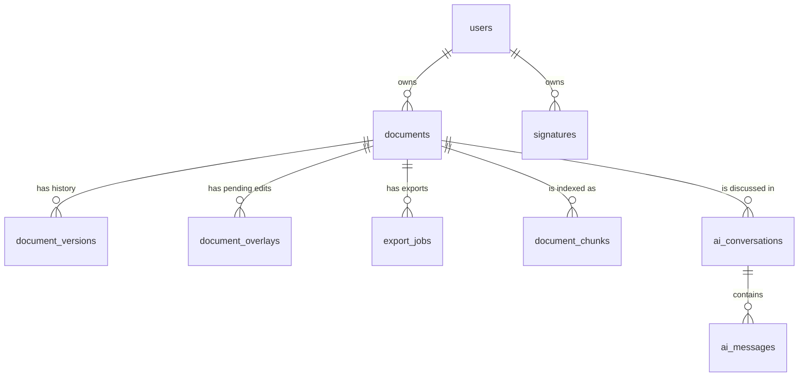

# Data model

Nine tables carry the whole application. Everything hangs off `users` → `documents`, and every
child row cascades on delete.



---

## `documents`

The library entry. The row points at the **immutable original upload**; it is never rewritten.

| Column | Type | Notes |
|---|---|---|
| `id` | bigint PK | |
| `user_id` | FK → `users` | Cascade delete. Every query is scoped by it. |
| `title` | string | User-editable display name; defaults from the filename. |
| `original_filename` | string | Kept as a label only — never used as a storage path. |
| `disk` | string | Defaults to `pdfs` (private local disk). |
| `path` | string | Server-generated `documents/<uuid>.pdf`. **Immutable.** |
| `page_count` | uint | Of the original. |
| `size_bytes` | ubigint | Of the original. |
| `mime` | string | Always `application/pdf`. |
| `source_type` | string enum | `native` · `scanned` · `mixed` · `unknown` |
| `status` | string enum | `ready` · `processing` · `failed` |
| `meta` | json | Per-page sizes (`pages`) and `thumbnail_path`. |
| `created_at` / `updated_at` | timestamps | |
| `deleted_at` | soft delete | Powers the Trash view and restore. |

Index: `(user_id, created_at)`.

`source_type` is detected at upload by `POST /pdf/info` and decides the Word-export strategy
later. See [`App\Enums\DocumentSourceType`](../app/Enums/DocumentSourceType.php).

### Active bytes

Two helpers on the model resolve "the file the user currently means":

```php
$document->activePath();       // newest version's path, else the original path
$document->activePageCount();  // newest version's page count, else the original's
```

Every feature — viewer, editor, export, page operations, AI indexing — reads through these, so
the notion of "current document" is defined in exactly one place.

---

## `document_versions`

Append-only history of flattened outputs. A version is produced by baking overlays, by a page
operation, or by restoring an older version (which appends a new one rather than deleting).

| Column | Type | Notes |
|---|---|---|
| `id` | bigint PK | |
| `document_id` | FK → `documents` | Cascade delete. |
| `version_number` | uint | Unique per document, monotonically increasing. |
| `path` | string | The flattened PDF on the document's disk. |
| `page_count` | uint | |
| `size_bytes` | ubigint | |
| `label` | string, nullable | Human-readable origin, e.g. "Reordered pages". |
| `created_by` | FK → `users`, nullable | `nullOnDelete`. |

Unique: `(document_id, version_number)`.

> Version 0 is implicit: it is the original upload. `document_versions` starts at 1.

---

## `document_overlays`

**The source of truth for an edited document.** Each row is one pending, non-destructive edit.
They are cleared once baked into a version.

| Column | Type | Notes |
|---|---|---|
| `id` | bigint PK | |
| `document_id` | FK → `documents` | Cascade delete. |
| `page_number` | uint | 1-based. |
| `type` | string enum | See below. |
| `payload` | json | Geometry **in PDF user space** plus style and content. |
| `z_index` | int | Stacking order. |
| `order` | uint | Tiebreaker within a `z_index`. |

Index: `(document_id, page_number)`.

### Overlay types

From [`App\Enums\DocumentOverlayType`](../app/Enums/DocumentOverlayType.php):

| Type | What it draws |
|---|---|
| `text` | A text box on top of the page |
| `whiteout` | An opaque rectangle that hides content underneath |
| `highlight` | A translucent filled rectangle |
| `underline` | A line along the bottom of a rectangle |
| `strike` | A line through the middle of a rectangle |
| `shape` | A rectangle, ellipse or line |
| `freehand` | A free-drawn polyline |
| `image` | A raster image placed in a rectangle |
| `signature` | A saved signature, baked as an image |
| `form_field` | A form value, baked as text (or an "X" for a checked box) |

Geometry is always points with a bottom-left origin, so a bake is deterministic regardless of
the zoom the edit was made at. See [Architecture § coordinate system](architecture.md#4-coordinate-system).

"Editing existing text" is not a separate type — it is a `whiteout` plus a `text` overlay.

---

## `signatures`

Reusable, per-user signatures, so a user draws theirs once.

| Column | Type | Notes |
|---|---|---|
| `id` | bigint PK | |
| `user_id` | FK → `users` | Cascade delete. |
| `name` | string | Label in the picker. |
| `type` | string enum | `draw` · `type` · `upload` |
| `data` | longtext | A PNG data URL. |

Index: `user_id`. The `type` is metadata for the list's label and icon — all three kinds are
stored as a PNG, so placing one is always the same operation.

---

## `export_jobs`

One row per Word-export run. Exports are asynchronous, so the row is the status the UI polls.

| Column | Type | Notes |
|---|---|---|
| `id` | bigint PK | |
| `document_id` | FK → `documents` | Cascade delete. |
| `created_by` | FK → `users`, nullable | `nullOnDelete`. |
| `format` | string enum | `pdf` · `docx` (today always `docx`). |
| `engine` | string, nullable | Which path ran: `pdf2docx` or `ocr+python-docx`. |
| `status` | string enum | `queued` → `processing` → `completed` / `failed` |
| `result_path` | string, nullable | `exports/<uuid>.docx`. |
| `result_filename` | string, nullable | The name offered on download. |
| `result_size_bytes` | uint, nullable | |
| `error` | text, nullable | Failure message shown in the modal. |
| `meta` | json, nullable | Strategy details, e.g. which pages were OCR'd. |

Index: `(document_id, status)`. The download route is scope-bound to the document and 404s
until the job is `completed`.

---

## `document_chunks`

The RAG index. One row per overlapping text chunk of a page.

| Column | Type | Notes |
|---|---|---|
| `id` | bigint PK | |
| `document_id` | FK → `documents` | Cascade delete. |
| `page_number` | uint | Carried through so answers can cite `(p. N)`. |
| `chunk_index` | uint | Order within the document. |
| `content` | text | The chunk text. |
| `embedding` | json, nullable | **A plain JSON float array**, not a pgvector column. |
| `embedding_model` | string, nullable | Which model produced it. |
| `token_count` | uint, nullable | |

Index: `(document_id, chunk_index)`.

`embedding_model` matters: vectors from different models are not comparable, so switching
embedding providers requires a re-index. `RagService` also re-indexes automatically when a
document's active bytes change.

> **Why JSON and not pgvector?** The development and CI PostgreSQL images do not have the
> `vector` extension available, and documents are owner-scoped and bounded, so ranking a few
> hundred vectors in PHP is cheap. The upgrade path is noted in the migration.

---

## `ai_conversations` and `ai_messages`

Chat history, scoped to one document *and* one user.

**`ai_conversations`** — `id`, `document_id` (FK), `user_id` (FK), `title` (nullable),
timestamps. Index: `(document_id, user_id)`.

**`ai_messages`** — `id`, `conversation_id` (FK → `ai_conversations`), `role`
(`user` · `assistant` · `system`), `content` (text), `tokens` (nullable), `meta` (json),
timestamps. Index: `conversation_id`.

`meta` records which backend and model answered, so the panel can show it and a conversation
stays readable after the user switches providers.

> A failed LLM call rolls back the user turn as well, so the history never contains a question
> with no answer.

---

## Authorization

[`App\Policies\DocumentPolicy`](../app/Policies/DocumentPolicy.php) gates everything:
`viewAny`, `view`, `create`, `update`, `delete`, `download`, `restore`, `forceDelete`. All of
them come down to "is this the owner?".

File routes apply the policy as middleware, and version and export routes use
`->scopeBindings()` so an ID belonging to a different document resolves to a 404 rather than
leaking its existence.

---

## Factories

Every model has a factory in [`database/factories/`](../database/factories/), used throughout
the test suite. Prefer them over hand-built models — several carry states that set up realistic
relationships for you.
